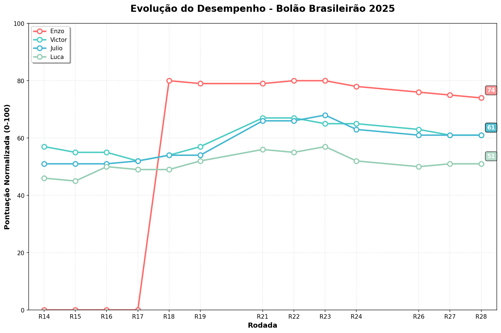

# Bolão Brasileirão 2025

## 🏆 Resultados Atuais

**Última Atualização:** 2025-08-04 22:12:21

| Time | Real | Victor | Julio | Luca |
|------|------|------|------|------|
| Flamengo | 1 | 2°(19p) | 1°(20p) | 1°(20p) |
| Cruzeiro | 2 | 14°(8p) | 17°(5p) | 11°(11p) |
| Palmeiras | 3 | 5°(18p) | 4°(19p) | 2°(19p) |
| Bahia | 4 | 4°(20p) | 6°(18p) | 7°(17p) |
| Mirassol | 5 | 20°(5p) | 18°(7p) | 19°(6p) |
| Red Bull Bragantino | 6 | 17°(9p) | 16°(10p) | 15°(11p) |
| Botafogo | 7 | 3°(16p) | 7°(20p) | 5°(18p) |
| São Paulo | 8 | 9°(19p) | 8°(20p) | 9°(19p) |
| Fluminense | 9 | 6°(17p) | 10°(19p) | 13°(16p) |
| Atlético-MG | 10 | 10°(20p) | 9°(19p) | 8°(18p) |
| Ceará | 11 | 13°(18p) | 11°(20p) | 18°(13p) |
| Corinthians | 12 | 7°(15p) | 3°(11p) | 6°(14p) |
| Internacional | 13 | 1°(8p) | 2°(9p) | 3°(10p) |
| Grêmio | 14 | 11°(17p) | 15°(19p) | 14°(20p) |
| Santos | 15 | 12°(17p) | 13°(18p) | 4°(9p) |
| Vitória | 16 | 18°(18p) | 19°(17p) | 20°(16p) |
| Vasco da Gama | 17 | 16°(19p) | 14°(17p) | 17°(20p) |
| Fortaleza | 18 | 8°(10p) | 5°(7p) | 10°(12p) |
| Juventude | 19 | 15°(16p) | 12°(13p) | 12°(13p) |
| Sport | 20 | 19°(19p) | 20°(20p) | 16°(16p) |
| **TOTAL** | | **308** | **308** | **298** |

### 🏅 Classificação Final (pontuação normalizada 0-100)

🥇 **Victor**: 54 pontos
🥈 **Julio**: 54 pontos
🥉 **Luca**: 49 pontos

### 📈 Histórico de Desempenho



| Rodada | Victor | Julio | Luca |
|-------|-------|-------|-------|
| R14 | 57 | 51 | 46 |
| R15 | 55 | 51 | 45 |
| R16 | 55 | 51 | 50 |
| R17 | 52 | 52 | 49 |
| R18 | 54 | 54 | 49 |

**Tendência (últimas 2 medições):**
- **Victor**: 📈 +2
- **Julio**: 📈 +2
- **Luca**: ➡️ =0

## 📖 Sobre o Projeto

Script em Python que captura em tempo real a classificação do Campeonato Brasileiro 2025 e compara com as previsões dos jogadores para calcular a pontuação do bolão.

## 📁 Arquivos

- **`scrape_brasileirao_simple.py`** - Script principal que captura dados e compara previsões
- **`bolao.json`** - Previsões dos jogadores em formato JSON
- **`requirements.txt`** - Dependências Python (matplotlib para gráficos)
- **`performance_chart.png`** - Gráfico visual gerado automaticamente
- **`score_history.json`** - Histórico de pontuações (gerado automaticamente)
- **`update_bolao.bat`** - Script de automação para Windows (execução + Git)

## 🚀 Como Usar

### Execução Manual
```bash
python scrape_brasileirao_simple.py
```

Ou com um arquivo de previsões customizado:
```bash
python scrape_brasileirao_simple.py minhas_previsoes.json
```

Para forçar atualização (ignorar checagem de mudanças):
```bash
python scrape_brasileirao_simple.py force
```

### Execução Automatizada (Windows)
Use o arquivo `update_bolao.bat` para execução automatizada com Git:

```batch
# Execução normal
update_bolao.bat

# Forçar atualização
update_bolao.bat -f
```

O script `.bat` automaticamente:
- 🐍 **Ativa o ambiente conda** (qt) se disponível
- 📊 **Executa o scraper** e atualiza dados
- 📝 **Faz commit e push** das alterações para o Git
- 🔄 **Funciona fora do VS Code** com detecção automática do ambiente Python

**Requisitos para o `.bat`:**
- Windows com conda/anaconda instalado, OU Python no PATH do sistema
- Git configurado (`git config --global user.name` e `user.email`)
- Repositório Git inicializado e conectado ao GitHub

## ⚡ Funcionalidades

- ✅ **Captura em tempo real** da ESPN Brasil e GE Globo
- ✅ Compara classificação real com previsões dos jogadores
- ✅ Calcula pontuação: 20 pontos menos desvio absoluto
- ✅ Mostra comparação lado a lado com pontuações
- ✅ **Atualiza automaticamente este README** com tabela de resultados
- ✅ **Ordena jogadores por pontuação total** (maior primeiro)
- ✅ Exibe classificação final com medalhas
- ✅ **Histórico de desempenho com gráfico visual** usando matplotlib
- ✅ **Detecção automática de mudanças** - só atualiza quando necessário
- ✅ Usa apenas bibliotecas nativas do Python (matplotlib opcional para gráficos)


## 🎯 Sistema de Pontuação

Para cada time, os jogadores recebem:
- **20 pontos** para acerto exato da posição
- **19 pontos** para 1 posição de diferença
- **18 pontos** para 2 posições de diferença
- ...até **1 ponto** para 19 posições de diferença
- **0 pontos** para 20 ou mais posições de diferença

**Pontuação total mínima possível:** 200 pontos
**Pontuação total máxima possível:** 400 pontos

**Pontuação final normalizada:**
`pontuação_normalizada = (pontuação_total - 200) / 2`
O resultado final sempre estará entre 0 e 100.

## 📈 Histórico e Gráficos

O sistema automaticamente:
- **Rastreia mudanças nas pontuações** a cada execução
- **Salva histórico em JSON** (`score_history.json`) apenas quando há mudanças
- **Gera gráfico visual** (`performance_chart.png`) usando matplotlib quando disponível
- **Gera tabela de evolução** no README mostrando últimas 10 medições
- **Indica tendências** comparando as duas últimas medições com emojis:
  - 📈 Subiu pontuação
  - 📉 Desceu pontuação  
  - ➡️ Manteve pontuação

### Gráfico Visual
O sistema gera automaticamente um gráfico de linhas mostrando a evolução das pontuações ao longo das rodadas, com:
- ✨ Cores diferentes para cada jogador
- 📊 Anotações com as pontuações mais recentes
- 🏁 Eixo X mostrando as rodadas do campeonato (R15, R16, etc.)
- 🎯 Escala de 0-100 pontos normalizados
- 📈 Rodada calculada automaticamente pelo maior número de jogos disputados

### Exemplo de Saída do Histórico

| Data/Hora | Victor | Luca | Julio |
|-------|-------|-------|-------|
| 17/07 23:32 | 55 | 44 | 49 |
| 18/07 10:15 | 56 | 45 | 50 |
| 18/07 13:14 | 57 | 46 | 51 |

**Tendência:** Victor 📈 +1, Luca 📈 +1, Julio 📈 +1

## 🌐 Fontes de Dados

O script tenta automaticamente múltiplas fontes confiáveis:
1. **ESPN Brasil** (`espn.com.br`) - Fonte principal
2. **Gazeta Esportiva** (`gazetaesportiva.com`) - Fonte alternativa confiável

## 💻 Exemplo de Saída

```
🏆 BRASILEIRÃO 2025 - BOLÃO RESULTS
Updated: 2025-07-17 21:00:05
================================================================================
Time                 Real    Victor      Julio       Luca
--------------------------------------------------------------------------------
Flamengo             1       2°(19p) 1°(20p) 1°(20p)
Palmeiras            2       5°(17p) 4°(19p) 2°(20p)
São Paulo            3       9°(14p) 8°(15p) 9°(14p)
...
--------------------------------------------------------------------------------
PONTUAÇÃO FINAL:             314         304         294

🏅 CLASSIFICAÇÃO:
1. Victor: 314 pontos
2. Julio: 304 pontos
3. Luca: 294 pontos
```

## 📋 Formato JSON para Previsões

O arquivo de previsões deve seguir esta estrutura:

```json
{
    "NomeJogador": {
        "1": "NomeTime",
        "2": "NomeTime",
        "3": "NomeTime",
        ...
        "20": "NomeTime"
    },
    "OutroJogador": {
        "1": "NomeTime",
        ...
    }
}
```

## 🛠️ Requisitos

- Python 3.6+ (usa apenas bibliotecas nativas)
- matplotlib (opcional, para gráficos visuais)

Para instalar matplotlib:
```bash
pip install matplotlib
```

## ⚙️ Como Funciona

1. **Captura classificação em tempo real** da ESPN Brasil ou GE Globo
2. Carrega previsões dos jogadores do arquivo JSON
3. Para cada time, compara posição prevista vs real
4. Calcula pontuação: `20 - |posição_prevista - posição_real|`
5. Soma pontuação de todos os times para cada jogador
6. Mostra resultados em tabela formatada com classificação
7. **Atualiza automaticamente este README** com tabela de resultados mais recente